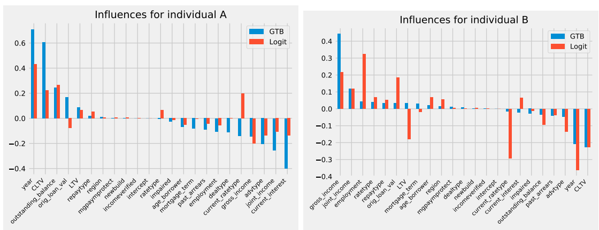
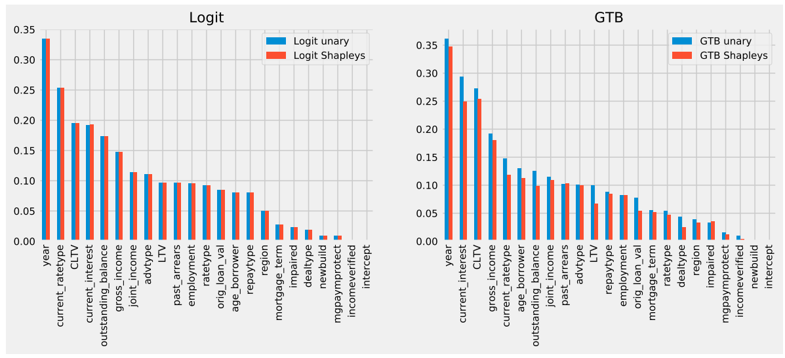
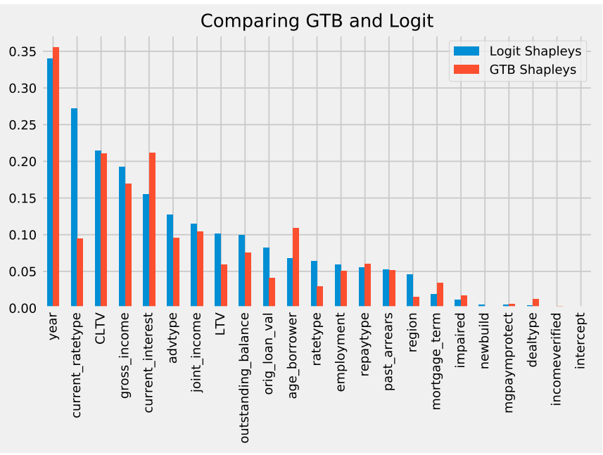
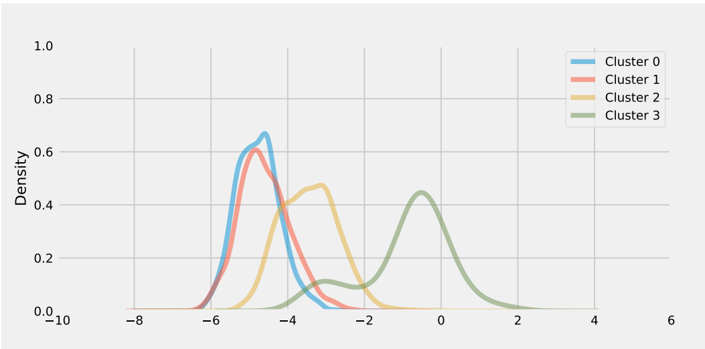
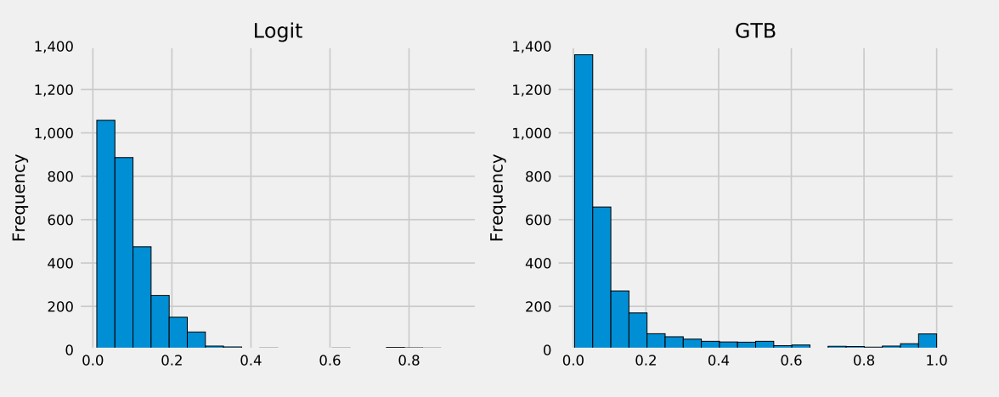

## Quantitative Input Influences (QII) Model
The QII model is a separate model used to identify the influence of features on the output.  These measures are derived from Shapley values, which are based on Game Theory.  By varying  inputs and observing the effect on output, it is possible to determine the influence of individual features over a large range of instances.  This allows for the presentation of four types of explanations, that are relevant to some or all of the stakeholders.

Two distinct models, logistic regression (logit) and Gradient Boosted Trees, were created.  Each has a seperate QII model to assess the influence of features.

Explanations are not given in textual terms, rather graphical display facilitates explanation.  The person-roles are according to practice in the Bank of England.  Since it is a central bank, the regulatory function receives more attention.

### Type 1 Explanations {.unnumbered}
These answer questions related to individual predictions.  Plots are generated for specific applicants showing feature influence in terms of log(Odds of default) compared to the average log odds across all applicants.  Figure 1 shows plots for two individual applicants.  

**Figure 1:** Which features mattered in individual predictions? \newline Source: Bracke (2019) 

The reference level, at $y = 0$ is the mean log(Odds) across all applications.  Features increase or decrease the probability of default (PD) depending upon a positive or negative value for log(Odds) respectively.  

Type 1 explanations enable the Developer to check if model results are sensible in individual cases and to check against benchmarks.  They provide additional information to the Conduct Regulator in order to validate model development.

Type 1 explanations show local influence.  The QII co-explainer model also gives global influence.

### Type 2 Explanations {.unnumbered}
These answer questions concerning the influence of features across a range of instances, such as the complete test set.  This allows for a general characterisation of a model and its operation.  The QII model determines feature influence simply by averaging absolute values for each individual in the test set.  This enables comparison of ML models, as in figure 2, which has plots for the logit and GBT models.    

**Figure 2:** Global feature influences, using log odds scores. \newline Source: Bracke (2019) 

The Unary values determine influence by randomising individual features while the Shapley method derives influence using game theory.

When applied to the test set, type 2 explanations give an overview of model generalisation and answer concerns about how a model is likely to operate in deployment.  These explanations allow a Developer to check that model results make sense.  First-line checkers have additional detail if there are problems with model accuracy or AUC value and they can report issues to management.  It provides information to Conduct Regulators to ensure that model development follows best practice.

### Type 3 Explanations {-}  

Type 3 explanations compare a ML model with a linear model, since the components of the linear model are accessible.  In figure, the linear benchmark is the logistic / logit model.  By comparing a ML model with the linear baseline, it enables the developer to determine if there are interactions between features.  This could occur in individual instances or groups of instances.  Shapley values are used since, after taking interactions into account, features have less influence than considering them in isolation.  So it gives assurance that feature interactions have been removed.

**Figure 3:** Global Shapley influences, Logit vs GTB. \newline Source: Bracke (2019) 

These types of graphs / explanations are of use to both model developer and first-line checker.  

### Type 4 Explanations {-}

In order to assess overall model operation, type 4 explanations compare feature value with feature influence.  This is to determine whether high or low values have greater influence.  Both correlations and scatterplots of feature value against influence are presented.  The purpose of scatterplots is to check for non-linear relationships.  Again, the measure for feature influence is log(Odds).  

To inspect for interaction between features, the QII model clusters features with similar influence (using K-means clustering).  

**Figure 4:** Clusters of features showing distribution of PD. \newline Source: Bracke (2019) 

The model then considers relative influence of features within a cluster.

### Type 5 Explanations {-}
These explanations result from stress testing by simulation.  A subset of the test data is modified to reflect stressed conditions.  Graphs show the distribution of default probability across the subset of loan applications.  They also compare different models using stress data.

**Figure 5:** Probability of default distribution for stress data. \newline Source: Bracke (2019) 

### Assessment {.unnumbered}
While the magnitude and sign of the log(Odds) give relative importance of features, these values are not intuitive.  It unlikely that anyone, apart from the Developer or Data Analyst, understands this metric.  Nevertheless, the same criticism can be made of the percentage $R^2$ of a given feature in multiple linear regression [@Johnson2000].  

Part of the originality in this thesis is to assess model plots in accordance with graphics principles and best practices [@Vandemeulebroecke2019].  

**Type 1 Explanations**  
The purpose of the graph is apparent (to show feature influence).  It shows the data clearly in this case.  However, high dimension data might lead to a cluttered plot.  The message is emphasised in the title of the graph (which features mattered most).  

In terms of practice, it uses a standard plot form (waterfall chart) to show deviance, it has a common scale, and it uses elements (bars) that give the most effective representations [@Cleveland1985].

**Type 2 and type 3 explanations**  
The attributes of type 1 explanations also apply for type 2  However, the message that the graph conveys is not clear.  A better title might be "Logit and GBT have similar global influence".   
 
The same applies to type 3 explanations, although the message given in the title could make reference to interactions.

**Type 4 Explanations**
The pitfall of presenting correlations and scatterplots is the possibility of "getting lost in the detail", when there are many features.  

It is apparent that the purpose of Figure 5 to display PD distribution and compare clusters.  Presentation of the data is unclear in the lack of scale units on the x-axis.  In addition, the message to be taken from the graph is absent.

In summary, consider that a hospital will allow a patient access to clinical notes only when a doctor is present to explain what they mean.  In the explanations provided by the QII model would seem to require input from a developer or data analyst in order to elaborate on their significance.  As such, the criticism of an engineering focus in ML interpretability is borne out here.  

## References
<bibliography entry-spacing = "2" >

